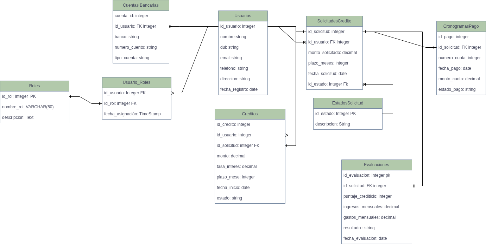

# 🔧 Backend API - Microcréditos

API REST para la plataforma de gestión de microcréditos, construida con Node.js, Express y MySQL.

## 🚀 Tecnologías

- **Node.js** - Runtime de JavaScript
- **Express** - Framework web
- **Prisma** - ORM para MySQL
- **MySQL** - Base de datos (XAMPP)
- **JWT** - Autenticación con tokens
- **Bcrypt** - Hash de contraseñas

## 📋 Requisitos Previos

- Node.js 18+ instalado
- XAMPP con MySQL corriendo
- Puerto 3306 disponible (MySQL)
- Puerto 5000 disponible (API)

## ⚙️ Instalación

### 1. Instalar dependencias

```bash
cd backend
npm install
```

### 2. Configurar variables de entorno

Copia el archivo `.env.example` a `.env`:

```bash
copy .env.example .env
```

El archivo `.env` ya está configurado para XAMPP con valores por defecto:

```env
NODE_ENV=development
PORT=5000

# MySQL (XAMPP)
DB_HOST=localhost
DB_PORT=3306
DB_NAME=microcreditos_db
DB_USER=root
DB_PASSWORD=
DB_DIALECT=mysql

# JWT
JWT_SECRET=microcreditos_secret_key_2025
JWT_EXPIRE=7d

# CORS
CORS_ORIGIN=http://localhost:3000
```

### 3. Crear base de datos

**Diagrama base de datos**


**Opción A: Usando phpMyAdmin (XAMPP)**

1. Abre XAMPP Control Panel
2. Inicia Apache y MySQL
3. Abre http://localhost/phpmyadmin
4. Ve a la pestaña "SQL"
5. Copia y pega el contenido de `database/init.sql`
6. Haz clic en "Continuar"

**Opción B: Usando Prisma Migrations**

1. Asegúrate de que MySQL esté corriendo en XAMPP
2. Ejecuta las migraciones de Prisma:

```bash
# Generar el cliente de Prisma
npx prisma generate

# Aplicar las migraciones a la base de datos
npx prisma migrate deploy

# O si es la primera vez, ejecuta:
npx prisma migrate dev --name init
```

3. (Opcional) Visualiza la base de datos con Prisma Studio:

```bash
npx prisma studio
```

### 4. Iniciar el servidor

```bash
# Modo desarrollo (con nodemon)
npm run dev

# Modo producción
npm start
```

El servidor estará corriendo en `http://localhost:5000`

## 📚 Endpoints de la API

### Autenticación

#### Registrar usuario

```http
POST /api/auth/register
Content-Type: application/json

{
  "nombre": "Juan Pérez",
  "correo": "juan@example.com",
  "telefono": "555-0123",
  "password": "password123",
  "departamento": "Santa Cruz",
  "municipio": "Warnes",
  "rol": "emprendedor"
}
```

#### Login

```http
POST /api/auth/login
Content-Type: application/json

{
  "correo": "juan@example.com",
  "password": "password123"
}
```

Respuesta:

```json
{
  "success": true,
  "message": "Login exitoso",
  "data": {
    "id": 1,
    "nombre": "Juan Pérez",
    "correo": "juan@example.com",
    "rol": "emprendedor"
  },
  "token": "eyJhbGciOiJIUzI1NiIsInR5cCI6IkpXVCJ9..."
}
```

#### Obtener usuario actual

```http
GET /api/auth/me
Authorization: Bearer {token}
```

### Solicitudes

#### Listar solicitudes

```http
GET /api/solicitudes
Authorization: Bearer {token}

# Filtros opcionales:
GET /api/solicitudes?estado=aprobado
GET /api/solicitudes?emprendedor_id=1
```

#### Crear solicitud

```http
POST /api/solicitudes
Authorization: Bearer {token}
Content-Type: application/json

{
  "datos_personales": {
    "nombre": "Juan Pérez",
    "cedula": "12345678",
    "telefono": "555-0123",
    "direccion": "Calle Principal 123",
    "departamento": "Santa Cruz",
    "municipio": "Warnes"
  },
  "datos_negocio": {
    "tipo": "Agricultura",
    "descripcion": "Producción de hortalizas",
    "ingresoMensual": 2500,
    "produccion": "500kg mensuales"
  },
  "datos_solicitud": {
    "monto": 5000,
    "plazoMeses": 12,
    "motivo": "Compra de semillas"
  }
}
```

#### Actualizar solicitud

```http
PUT /api/solicitudes/:id
Authorization: Bearer {token}
Content-Type: application/json

{
  "estado": "enviado",
  "datos_solicitud": {
    "monto": 6000,
    "plazoMeses": 12,
    "motivo": "Compra de semillas y fertilizantes"
  }
}
```

#### Aprobar solicitud (Evaluador/Admin)

```http
POST /api/solicitudes/:id/aprobar
Authorization: Bearer {token}
```

### Cronogramas

#### Obtener cronograma por ID

```http
GET /api/cronogramas/:id
Authorization: Bearer {token}
```

#### Obtener cronograma por solicitud

```http
GET /api/cronogramas/solicitud/:solicitudId
Authorization: Bearer {token}
```

#### Marcar cuota como pagada (Evaluador/Admin)

```http
PATCH /api/cronogramas/:id/cuotas/:cuotaId/pagar
Authorization: Bearer {token}
```

## 🗂️ Estructura del Proyecto

```
backend/
├── prisma/
│   ├── schema.prisma            # Esquema de base de datos (modelos)
│   └── seed.js                  # Datos iniciales (roles)
├── src/
│   ├── config/
│   │   └── prisma.js            # Cliente de Prisma
│   ├── controllers/
│   │   ├── auth.controller.js
│   │   ├── solicitudes.controller.js
│   │   └── cronogramas.controller.js
│   ├── routes/
│   │   ├── auth.routes.js
│   │   ├── usuarios.routes.js
│   │   ├── solicitudes.routes.js
│   │   └── cronogramas.routes.js
│   ├── middlewares/
│   │   ├── auth.middleware.js
│   │   ├── role.middleware.js
│   │   └── error.middleware.js
│   ├── utils/
│   │   ├── cronograma.util.js   # Cálculo de cuotas
│   │   └── scoring.util.js      # Cálculo de score
│   └── server.js                # Servidor principal
├── database/
│   └── init.sql                 # Script SQL (opcional)
├── assets/
│   └── microcreditos_bd.drawio.png  # Diagrama de BD
├── .env                         # Variables de entorno
├── .env.example
├── .gitignore
├── package.json
├── run-seed.js                  # Script para ejecutar seed
└── README.md
```

## 🔐 Roles y Permisos

### Emprendedor

- ✅ Crear solicitudes
- ✅ Ver sus propias solicitudes
- ✅ Actualizar sus solicitudes (si están en borrador)
- ✅ Ver sus cronogramas

### Evaluador

- ✅ Ver todas las solicitudes
- ✅ Aprobar/rechazar solicitudes
- ✅ Generar cronogramas
- ✅ Marcar cuotas como pagadas

### Admin

- ✅ Todos los permisos de evaluador
- ✅ Gestión de usuarios

## 🧮 Cálculo de Cuotas

El sistema utiliza el **sistema francés** (cuota fija) para calcular el cronograma de pagos:

- Tasa de interés: 12% anual
- Cuota mensual fija
- Amortización de capital creciente
- Intereses decrecientes

## 📊 Sistema de Scoring

El scoring automático evalúa solicitudes basándose en:

1. **Capacidad de pago (40 puntos)**: Ratio cuota/ingreso
2. **Monto vs ingresos (30 puntos)**: Ratio monto/ingresos anuales
3. **Plazo (20 puntos)**: Plazo óptimo entre 6-12 meses
4. **Tipo de negocio (10 puntos)**: Bonus para sectores prioritarios

**Recomendaciones:**

- Score ≥ 80: Aprobación recomendada
- Score 60-79: Evaluación manual
- Score 40-59: Evaluación detallada
- Score < 40: Rechazo recomendado

## 🧪 Probar la API

### Usando EchoAPI (VS Code)

1. Instala la extensión EchoAPI desde el marketplace de VS Code
2. Crea una nueva colección para el proyecto de Microcréditos
3. Configura las variables de entorno:
   - `baseUrl`: `http://localhost:5000`
   - `token`: (se llenará después del login)
4. Crea los requests para cada endpoint
5. Usa el token JWT en Authorization > Bearer Token

### Usando Postman

1. Importa la colección
2. Configura el environment con `baseUrl = http://localhost:5000`
3. Usa el token JWT en Authorization > Bearer Token

## 🐛 Solución de Problemas

### Error: Cannot connect to MySQL

- Verifica que XAMPP esté corriendo
- Verifica que MySQL esté en puerto 3306
- Revisa las credenciales en `.env`

### Error: Database does not exist

- Ejecuta el script `database/init.sql` en phpMyAdmin

### Error: Port 5000 already in use

- Cambia el puerto en `.env`
- O detén el proceso que usa el puerto 5000

## 📝 Licencia

Este proyecto es privado y está en desarrollo.
